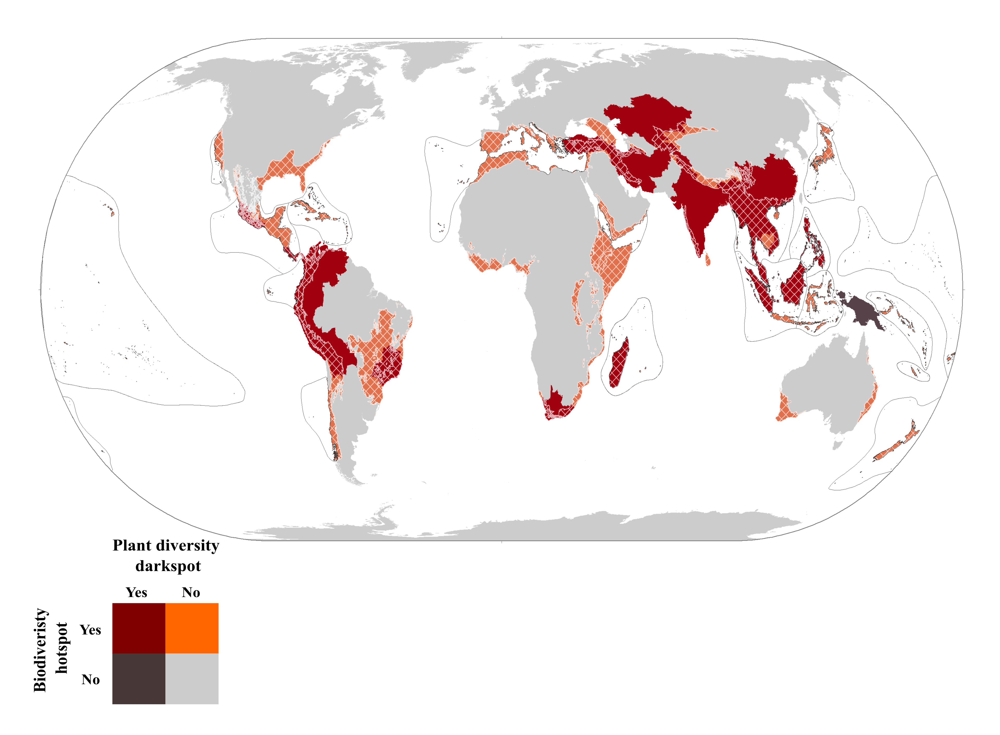

<!-- README.md is generated from README.Rmd. Please edit that file -->

# Plant diversity darkspots

<!-- badges: start -->

<!-- badges: end -->

 

 

## Background

Recent estimates indicate that **more than 15% of the world’s vascular
plant species remain scientifically unknown** and many known species
have no geographic records documenting their distribution. Identifying
knowledge gaps and understanding their historical drivers is thus
essential to guide the prioritization of data collection and to inform
conservation strategies at global and national scales. We believe that
using metrics of diversity knowledge gaps provides valuable and
complementary information to further develop and improve conservation
actions. 

## Approach

Using the World Checklist of Vascular Plants (WCVP) and a range of
species- and human-related variables known to influence species
discovery and detection, our team model the time to species’ first
description and geolocation to predict how many species are currently
scientifically unknown and lack geolocation (Ondo et al., n.d.). We
investigate (mis-)matches between the 36 known biodiversity hotspots
(i.e., areas with exceptional concentration of endemic and threatened
species) and areas with most important gaps in taxonomic and geographic
knowledge (i.e., plant diversity “darkspots”), and the importance of the
socioeconomic context of countries when prioritising regions for future
collection efforts.

## Data and code availability

The data that support our work are made openly available at
<https://doi.org/10.5281/zenodo.11110630>

## References

Ondo, Ian, Kiran L. Dhanjal-Adams, Samuel Pironon, Daniele Silvestro,
Matheus Colli-Silva, Victor Deklerck, Olwen M. Grace, et al. n.d. “Plant
Diversity Darkspots for Global Collection Priorities.” *New Phytologist*
n/a (n/a). https://doi.org/<https://doi.org/10.1111/nph.20024>.

